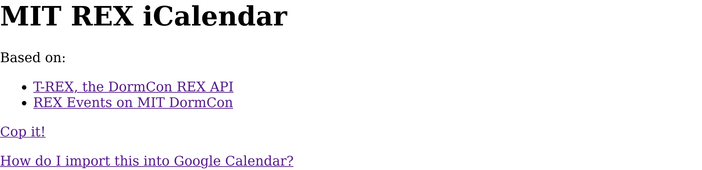
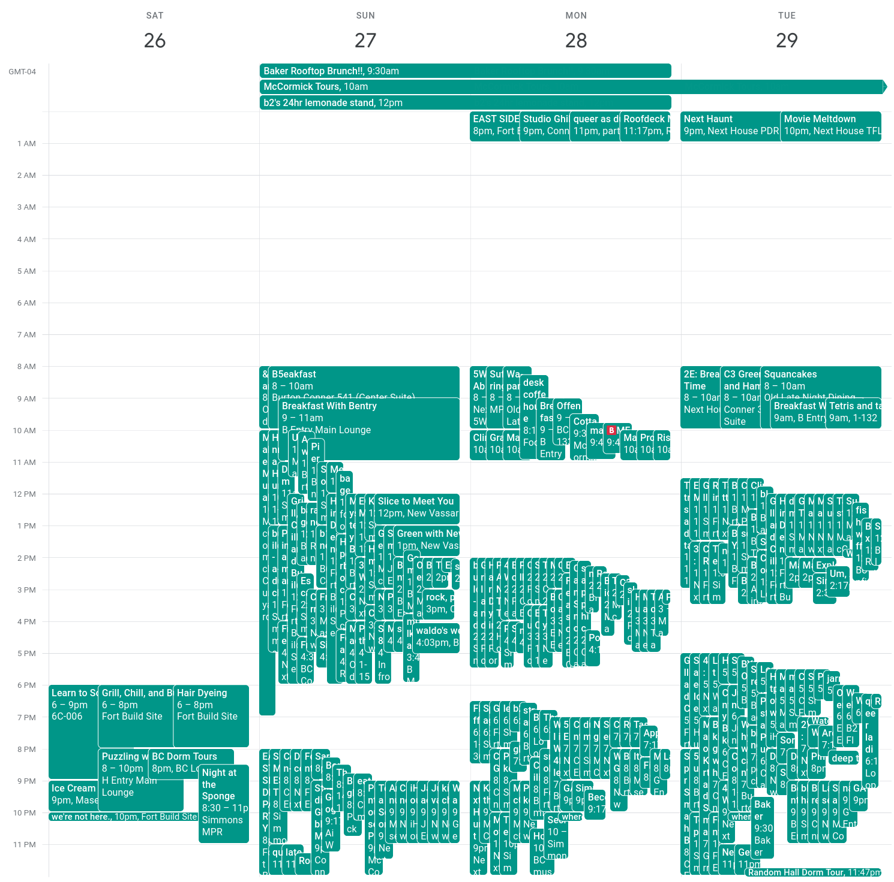

# MIT REX iCalendar

A calendar for events at MIT's [**R**esidence **EX**ploration](https://dormcon.mit.edu/rex/).

I wrote this in 30 minutes. Done this same song and dance so many times I can do it with my eyes closed. Maybe I should make an


Based on:
- https://rex.mit.edu/
- https://github.com/mit-dormcon/t-rex
- https://dormcon.mit.edu/rex/events/


## Deploy
```bash
poetry install
# For the lazy...
python3 main.py 
# For the more upstanding
gunicorn 'rex_ical:create_app()'
```

## Screenshots

Index of web server:


Generated calendar imported into Google Calendar:

